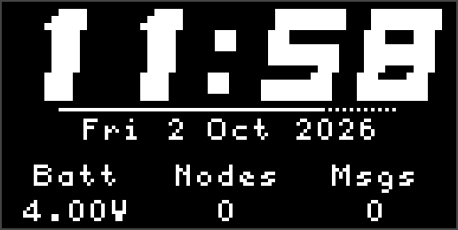
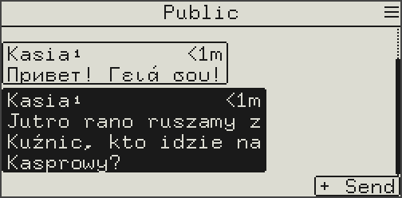

# MeshCore Solo

Solo is a MeshCore companion firmware that works on its own: messages, contacts,
GPS navigation and tools right on the device, no phone needed. The phone app
still connects as with the stock firmware, over Bluetooth or USB.

**Try it in your browser: [solo.marekzegarek.com](https://solo.marekzegarek.com)**

## What it does

- **Messages without a phone**: channels, direct messages and rooms, with
  quick replies, live placeholders (`{loc}`, `{time}`, sensor readings) and
  keyboards for Latin, Cyrillic, Greek and European diacritics.
- **GPS navigation**: trail recording with GPX export, waypoints, a compass,
  navigate to any node, waypoint or shared location, live location sharing
  and a geofence alert (Locator).
- **Nearby nodes**: who's around, signal and distance, ping, and remote
  admin of your repeaters and rooms.
- **Tools**: clock with alarm, timer and stopwatch, a remote bot that answers
  commands over the mesh, repeater mode, a ringtone editor, and a status
  screen with the radio, GPS, battery and mesh counters.
- **Screen lock** with an optional PIN.
- **On the Wio Tracker L2**: an offline map, message history on the SD card,
  the SD card as a USB drive, updates over WiFi.

## Devices

The firmware is the same everywhere; how you drive it depends on the device.
These docs mark the differences with notes like this:

> [!NOTE]
> **Wio Tracker L2:** what's different on the touch screen.

| Group | Devices | Controls |
| ----- | ------- | -------- |
| **Joystick** | Wio Tracker L1 (OLED / e-ink), GAT562 30S, GAT562 Watch13, Heltec V3/V4 with a joystick | Four directions, Enter, Back |
| **Keyboard** | M5Stack Cardputer ADV, T-Echo Lite + KeyShield, any board with a CardKB | Keys; arrows or their Fn combinations for the directions |
| **Touch** | Wio Tracker L2 | Taps, swipes and holds; two side buttons |

| OLED | E-ink | Wio Tracker L2 |
| :---: | :---: | :---: |
|  |  |  |

The joystick and keyboard devices share one interface, sized for small OLED
and e-ink screens. The Wio Tracker L2 has its own, built for a 320 × 240
colour touch screen, with extras its hardware allows: an offline map, message
history on the SD card and updates over WiFi.

## Pages

- [Getting started](./getting-started.md): controls, the home screen and its quick panels, the phone app, updates
- [Messages](./messages.md): channels, direct messages, rooms, typing
- [Contacts](./contacts.md): nearby nodes, favourites, remote admin
- [Navigation](./navigation.md): GPS, trail, waypoints, compass, sharing your location, the map
- [Tools](./tools.md): clock tools, bot, repeater, ringtones, the Status screen
- [Settings](./settings.md): what is where
- [Screen lock](./lock.md): locking, auto-lock, PIN
- [Hardware](./hardware.md): external keyboards and joysticks, e-ink, SD card, WiFi

For developers: [UI Core](./developer/ui-core.md), [UI framework](./developer/ui-framework.md), [build flags](./developer/build-flags.md), [feature matrix](./developer/feature-matrix.md).

## Contributors

Big thanks to the people who contributed to Solo:
[vanous](https://github.com/vanous), [marczykm](https://github.com/marczykm),
[tchellow](https://github.com/tchellow) and [3urobeat](https://github.com/3urobeat).

Built on [MeshCore](https://github.com/meshcore-dev/MeshCore) and the work of
its [community](https://github.com/meshcore-dev/MeshCore/graphs/contributors).
